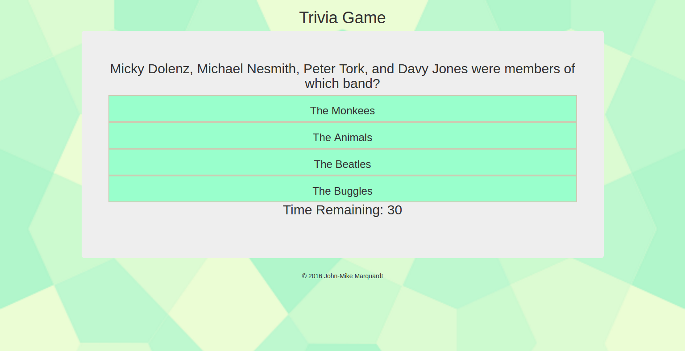

# Trivia Game

## Description 
A simple trivia game using HTML, CSS, JavaScript and jQuery.  This was an exercise in dynamically generating HTML elements using JavaScript and jQuery.  This was also an exercise in using timers and counters in JavaScript.

## Screenshot

## Technologies used
* HTML
* CSS
* JavaScript
* jQuery

## Built with 
* Sublime Text

## Future Improvement
* Style
* Timers don't always work properly
* use a trivia API for questions and answers instead of hard coding an array

## Author
John-Mike Marquardt